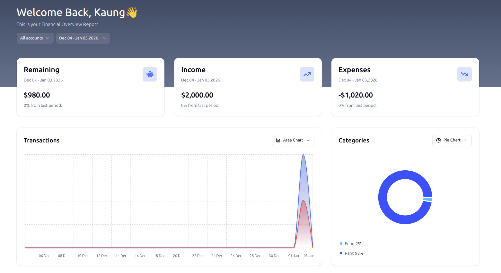
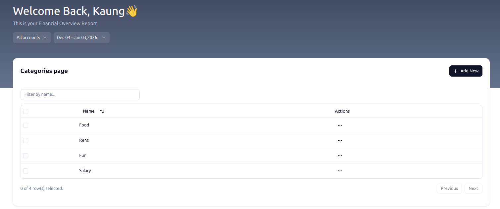

# 🐾 Meowney (Ledger)
**A purr-fectly simple personal finance tracker to manage your spending and savings.**

Meowney is a modern web application built with [Next.js](https://nextjs.org/) and [Clerk](https://clerk.dev/) designed to give you a clear overview of your financial health. Track your expenses, organize them by category, and manage multiple accounts with ease.

## ✨ Key Features

- **Personal Dashboard**: A birds-eye view of your total balance, recent transactions, and spending trends.
- **Smart Categorization**: Group your spending into custom categories like Food, Entertainment, and Bills.
- **Account Management**: Separate your personal, business, and savings accounts in one place.
- **Secure Authentication**: Powered by Clerk for a safe and seamless login experience.

## 📸 Screenshots

### Dashboard
Overview of your financial status at a glance.


### Categories
Manage and visualize your spending habits by group.


### Accounts
Keep track of different banks or cash wallets.


---

## 🚀 Getting Started

First, install the dependencies (including a fix for React 19 peer dependency conflicts):

```bash
npm install --legacy-peer-deps
```

## Getting Started

Then, run the development server:

```bash
npm run dev
# or
yarn dev
# or
pnpm dev
# or
bun dev
```

Open http://localhost:3000 with your browser to see the result.

## 🛠️ Tech Stack
- Framework: Next.js 15+

- Auth: Clerk

- Styling: Tailwind CSS

- Database: (Add your database here, e.g., Prisma + PostgreSQL)

- Icons: (Add your icon library here, e.g., Lucide React)

Created with ❤️ by Kaung Myat (George)